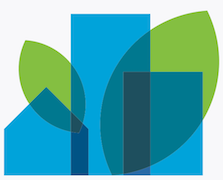

# Dreamhouse Lightning Web Components Sample Application

  

> [!IMPORTANT]
> This is the modern Lightning Web Components version of the Dreamhouse sample application. If you are looking for the legacy Aura version, click [here](https://github.com/dreamhouseapp/dreamhouse-sfdx).

Dreamhouse is a sample application that demonstrates the unique value proposition of the Salesforce platform for building Employee Productivity and Customer Engagement apps.

    
    Learn more about this app by completing the <a href="https://trailhead.salesforce.com/en/content/learn/projects/quick-start-dreamhouse-sample-app">Quick Start: Explore the Dreamhouse Sample App</a> Trailhead project or by watching this <a href="https://www.youtube.com/watch?v=UvUDi8acq2w&list=PLgIMQe2PKPSJcuCwM61dEc4jFG_jHqV2t&index=4">short presentation video</a>.
     
     
     

> This sample application is designed to run on Salesforce Platform. If you want to experience Lightning Web Components on any platform, please visit https://lwc.dev, and try out our Lightning Web Components sample application [LWC Recipes OSS](https://github.com/trailheadapps/lwc-recipes-oss).
